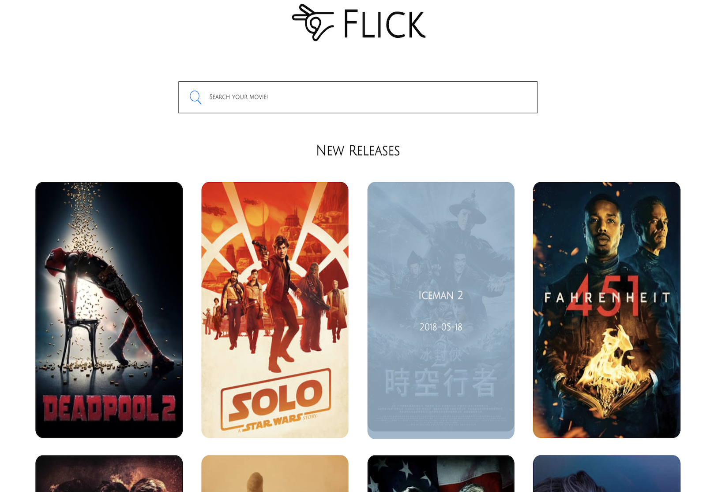

# Flick

Flick is a movie search app built with React, and uses The Movie Database (TMDb) API to search and display data.

See a live demo at: https://flickmovies.netlify.com

* New releases section which lists popular movies released within the last month.
* Search movies by title.
* View detailed movie info that includes the rating, number of votes, cast, genres, and poster.

## Getting Started

- Install all dependencies (using the `npm install` command).
- Run the development web server using the `node express_server.js` command.

# Current Bugs
* None at the moment. If you find one please message me!
